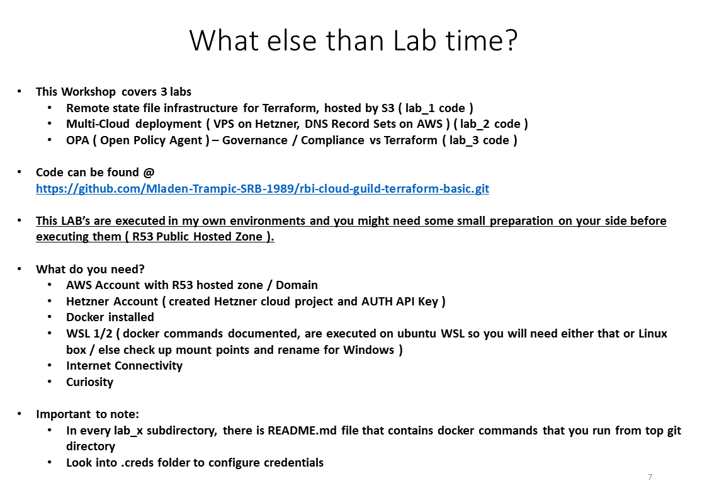

# Image Slide


# Requirements
- Hetzner Cloud account
- AWS Account
    - Public hosted zone / registered domain 
- Windows 10 with Docker / WSL 2
- Ubuntu WSL 

# Hard note to myself to fix , and to you to be careful ! 
in lab_2/main.tf I have hardcoded my Public Hosted Zone for terraform Data Provider, that needs to be replaced.
```Terraform
data "aws_route53_zone" "hosted_zone" {
  name         = "trampic.info."
}
```
# What to do ?
setup .creds folder, with credentials

have fun :) !