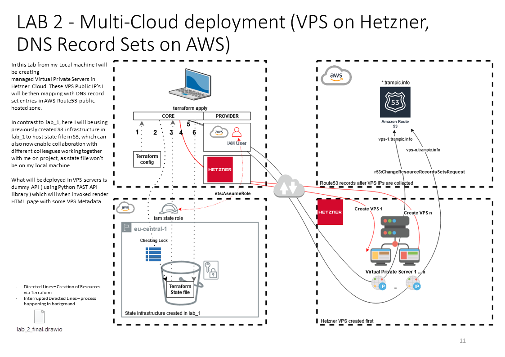

# Image Slide


# Commands 
Step 0 copy output of previous lab_1 root_module_state_tfvars_json into file root_module_state.tfvars.json

Step 1 initialize, to download provider
```bash
docker run --rm -it -v ${PWD}/.creds:/terraform/.creds -v ${PWD}/lab_2:/terraform -w=/terraform --user "$(id -u):$(id -g)" hashicorp/terraform:0.12.28 init -backend-config /terraform/root_module_state.tfvars.json
```

Step 2 terraforming
To create:
```bash
docker run --rm -it -v ${PWD}/.creds:/terraform/.creds -v ${PWD}/lab_2:/terraform -w=/terraform --user "$(id -u):$(id -g)" hashicorp/terraform:0.12.28 apply -var-file /terraform/.creds/hetzner.tfvars -var-file /terraform/root_module.tfvars.json 
```

To Destroy ( cleanup ):
```bash
docker run --rm -it -v ${PWD}/.creds:/terraform/.creds -v ${PWD}/lab_2:/terraform -w=/terraform --user "$(id -u):$(id -g)" hashicorp/terraform:0.12.28 destroy -var-file /terraform/.creds/hetzner.tfvars -var-file /terraform/root_module.tfvars.json
```

# Resource
[draw.io lab_2_final](resources/lab_2_final.drawio)
