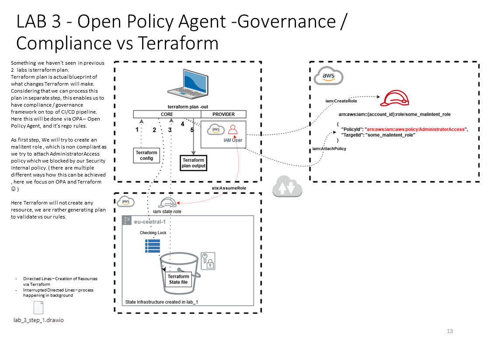

Step 0 copy output of previous lab_1 root_module_state_tfvars_json into file root_module_state.tfvars.json

Make sure you are in root of project ${SOME_PATH...}/terraform_workshop/

Step 1 initialize, to download provider

```bash
docker run --rm -it -v ${PWD}/.creds:/terraform/.creds -v ${PWD}/lab_3:/terraform -w=/terraform --user "$(id -u):$(id -g)" hashicorp/terraform:0.12.28 init -backend-config /terraform/root_module_state.tfvars.json
```

Step 2 terraforming

Do a plan:

```bash
docker run --rm -it -v ${PWD}/.creds:/terraform/.creds -v ${PWD}/lab_3:/terraform -w=/terraform --user "$(id -u):$(id -g)" hashicorp/terraform:0.12.28 plan -var-file /terraform/root_module.tfvars.json -out /terraform/plan_output/tfplan.binary
```

Convert plan from binary to json:

```bash
docker run --rm -it -v ${PWD}/.creds:/terraform/.creds -v ${PWD}/lab_3:/terraform -w=/terraform  --user "$(id -u):$(id -g)" hashicorp/terraform:0.12.28 show -json /terraform/plan_output/tfplan.binary | jq . | jq .  > lab_3/plan_output/tfplan.json
```

let's check up OPA vs TF Plan


```bash
docker run --rm -it -v ${PWD}/lab_3:/open_policy_agent -w=/open_policy_agent openpolicyagent/opa eval --format pretty --data opa_rules/terraform.rego --input plan_output/tfplan.json "data.terraform.analysis.authz"
```

If we imagine CI/CD pipeline doing something like:

```bash
if [ $(docker run --rm -it -v ${PWD}/lab_3:/open_policy_agent -w=/open_policy_agent openpolicyagent/opa eval --format pretty --data opa_rules/terraform.rego --input plan_output/tfplan.json "data.terraform.analysis.authz") ]
then
docker run --rm -it -v ${PWD}/.creds:/terraform/.creds -v ${PWD}/lab_3:/terraform -w=/terraform --user "$(id -u):$(id -g)" hashicorp/terraform:0.12.28 apply -var-file /terraform/root_module.tfvars.json -auto-approve
fi
```

Full sample ...
Here we have actually terraform file blocking_rule.tf which is creating IAM role, and hence this is non compliant with OPA Rego rule. ( comment out / in - rerunn script )
```bash
. lab_3/imagine_ci_cd.sh
```
get=aws_autoscaling_group.my_asg -auto-approve
```

To Destroy ( cleanup ):

```bash
docker run --rm -it -v ${PWD}/.creds:/terraform/.creds -v ${PWD}/lab_3:/terraform -w=/terraform --user "$(id -u):$(id -g)" hashicorp/terraform:0.12.28 destroy -var-file /terraform/root_module.tfvars.json 
```

# Image Slide
## Step 1

## Step 2

## Step 3

## Step 4


# Resource
[draw.io lab_3_step_1](resources/lab_3_step_1.drawio)
[draw.io lab_3_step_2](resources/lab_3_step_2.drawio)
[draw.io lab_3_step_3](resources/lab_3_step_3.drawio)
[draw.io lab_3_step_4](resources/lab_3_step_4.drawio)